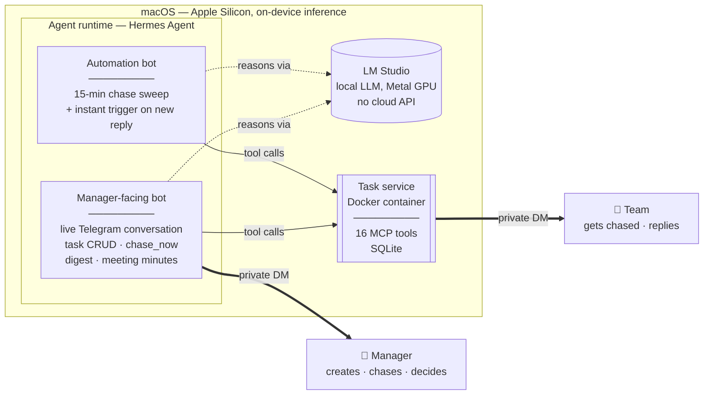

# pm-chaser


**An AI project-management assistant that runs entirely on local hardware — no cloud AI API, ever.**

pm-chaser tracks who owes what by when, chases task owners on Telegram, reads their free-text replies well enough to update task status without a single keyword rule, and gives the manager a plain-English status report on demand. It's been in daily, real-world use since August 2026 — not a demo, a tool an actual manager relies on to run an actual team.

Every message it writes, every reply it interprets, every judgment call it makes is generated by a language model running on-device via [LM Studio](https://lmstudio.ai) — never a cloud AI API. (Telegram itself is, of course, a cloud messaging service — that's inherent to using it as the interface. The part that's local is the *thinking*.)

---

## What it actually does

**Task tracking & chasing**
- Create, update, reassign, or cancel tasks through plain conversation — no command syntax
- Automatically pings task owners on a priority-driven cadence, reads their reply, and updates status — a message like *"waiting on the finance sheet"* becomes `status: blocked`, inferred, not pattern-matched
- Near-instant reply pickup: a small host-side listener triggers an immediate chase run the moment a reply arrives, instead of waiting for the next scheduled sweep (see [Architecture](./docs/ARCHITECTURE.md#event-driven-reply-handling))
- On-demand override ("chase Daniel now") and live reply checks, independent of the automated schedule

**Manager-only decisions, enforced structurally**
- A task owner can never grant themselves a deadline extension — any request routes to the manager as a blocker, and approving it is what un-blocks the task and resumes chasing
- Every "message sent" confirmation is backed by a real API response, not the model's word for it — a lesson learned from a real incident where a smaller local model claimed to have sent a message it never actually sent

**Reporting**
- A prioritized digest, on demand: overdue work, blockers needing a decision, people gone quiet, anyone unreachable — composed in natural prose, not a data dump

**Bulk & multi-modal intake**
- Upload a spreadsheet, PDF, or photo of a task list → extracted, resolved against real people, previewed once, created on approval
- Send a voice recording, PDF, Word doc, or just typed notes from a meeting → transcribed/extracted, summarized, and turned into real tasks with suggested priorities inferred from the meeting's own language
- Fill a blank document template (e.g. a delivery order) from a short free-text note — reads the template's real fields, fills only what the note actually covers, flags the rest

**A fixed, dependable identity**
- The manager-facing assistant has one persona — **S.A.M.** — always addressed the same way, never improvised, so behavior stays predictable across every conversation

---

## Architecture



**The dividing line that shapes the whole design**: code decides *what* and *who* — which tasks are overdue, who was pinged too recently, who to escalate. The model decides *what to say* and *what a reply means*. Rules that must always hold live in code, where they're guaranteed; everything that requires judgment or language stays with the model. This wasn't the original design — it came from a real debugging session where the opposite approach quietly failed.

**→ Full system diagram, sequence flows, and data model: [`docs/ARCHITECTURE.md`](./docs/ARCHITECTURE.md)**

## Stack

| Layer | Choice |
|---|---|
| Reasoning | Local LLM (MoE) via LM Studio — on-device, Metal GPU, zero cloud dependency |
| Agent runtime | [Hermes Agent](https://github.com/NousResearch/hermes-agent), two isolated profiles |
| Tool interface | [Model Context Protocol](https://modelcontextprotocol.io) — one tool server, shared by both agents |
| Agent behavior | Plain-language instruction files — no code governs tone, escalation logic, or judgment calls |
| Task service | Python 3.12, the official MCP SDK, exposed over `streamable-http` |
| Data | SQLite + SQLAlchemy |
| Messaging | Telegram Bot API, two separate bots (manager-facing / team-facing) |
| Hosting | Plain Docker, `--restart=always` — deliberately *not* Kubernetes, after trying it first |
| Scheduling | Hermes cron, plus an event-driven listener for near-instant reply handling |

**→ What each AI/agent component actually does, and why: [`docs/AI_TOOLING.md`](./docs/AI_TOOLING.md)**
**→ Full MCP tool catalog (all 16 tools): [`docs/MCP_TOOLS.md`](./docs/MCP_TOOLS.md)**

## Repository tour

```
server/            The MCP tool service — task/person CRUD, chase planning, Telegram I/O, SQLAlchemy models
listener/          chase_listener.py — host-side event-driven reply detection (launchd service)
hermes-config/     The live, version-controlled brains of both bots: SOUL.md, SKILL.md files, config.yaml
                   (symlinked back to ~/.hermes — see hermes-config/README.md)
skills/            Original pre-Hermes-migration skill definitions, kept for reference
docs/              Architecture, MCP tool catalog, and AI/agent tooling deep dives
k8s/               Kubernetes manifests from an earlier deployment, superseded by plain Docker — kept
                   for reference, not the live deployment
PROJECT_MANAGEMENT.md   The full running devlog: every decision, bug, and fix, in the order it happened
```

## Engineering highlights

A local ~35B model chaining several tool calls with judgment calls in between fails in specific, learnable ways. The fixes that came out of hitting those failures for real, in production, are documented in depth in [`docs/AI_TOOLING.md`](./docs/AI_TOOLING.md#real-engineering-problems-this-surfaced-and-how-they-were-closed) and [`PROJECT_MANAGEMENT.md`](./PROJECT_MANAGEMENT.md):

- Collapsed multi-step chase/digest logic into single, server-side planning calls after the model proved unreliable at chaining 5+ tool calls with filtering logic in between
- Disabled a tool-discovery bridge that the model would unpredictably route through even when a tool was already directly callable — including one case of a once-only tool getting called twice in the same run
- Closed a "confident-but-false" failure mode where the model narrated a successful send without ever calling the send tool, by making job success depend on a real, verified tool result — never the model's own summary
- Found and fixed a timezone bug that silently pushed every deadline eight hours off, breaking overdue detection for an entire working day
- Migrated the task service off Kubernetes to plain Docker after concluding — honestly, against the instinct to keep it for portfolio value — that a single-node deployment gained nothing from it but LoadBalancer IP drift and tunnel deaths

## Documentation

| Doc | What's in it |
|---|---|
| [`docs/ARCHITECTURE.md`](./docs/ARCHITECTURE.md) | System diagram, event-driven reply handling, data model, deployment history |
| [`docs/MCP_TOOLS.md`](./docs/MCP_TOOLS.md) | Every MCP tool, its signature, and why it exists |
| [`docs/AI_TOOLING.md`](./docs/AI_TOOLING.md) | The model, the agent runtime, MCP, skills-as-prompts, and every real reliability fix |
| [`PROJECT_MANAGEMENT.md`](./PROJECT_MANAGEMENT.md) | The complete build history — every decision and its reasoning, warts included |
| [`hermes-config/README.md`](./hermes-config/README.md) | How the live bot instructions are version-controlled via symlinks |

## Status

Live and in daily use. Names, phone numbers, and identifiers throughout the docs and devlog have been anonymized for public release; nothing about the system's actual behavior was changed to do so.

## License

[MIT](./LICENSE)
