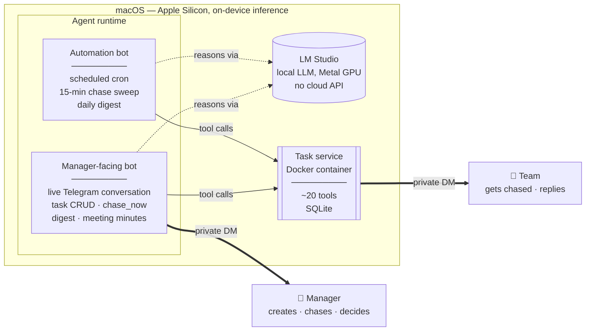

# pm-chaser

**An AI project-management assistant that runs entirely on local hardware — no cloud AI API, ever.**

pm-chaser tracks who owes what by when, chases task owners on Telegram, reads their free-text replies well enough to update task status without a single keyword rule, and gives the manager a plain-English daily digest. It's been in daily, real-world use since August 2026 — not a demo, a tool an actual manager relies on to run an actual team.

Every message it writes, every reply it interprets, every judgment call it makes — all of it is generated by a language model running on-device via [LM Studio](https://lmstudio.ai), never a cloud AI API. (Telegram itself is, of course, a cloud messaging service — that's inherent to using it as the interface. The part that's local is the *thinking*.)

---

## What it actually does

**Task tracking & chasing**
- Create, update, reassign, or cancel tasks through plain conversation — no command syntax
- Automatically pings task owners on a priority-driven cadence, reads their reply, and updates status — a message like *"waiting on the finance sheet"* becomes `status: blocked`, inferred, not pattern-matched
- On-demand override ("chase Henry now") and live reply checks, independent of the automated schedule
- Escalates to the manager after repeated silence, grouped into one message per person — never a spam of pings

**Manager-only decisions, enforced structurally**
- An employee can never grant themselves a deadline extension — any request routes to the manager as a blocker, and approving it is what un-blocks the task and resumes chasing
- Every "message sent" confirmation is backed by a real API response, not the model's word for it — a lesson learned from a real incident where a smaller local model claimed to have sent a message it never actually sent

**Reporting**
- A prioritized daily/on-demand digest: overdue work, blockers needing a decision, people gone quiet, anyone unreachable — composed in natural prose, not a data dump

**Bulk & multi-modal intake**
- Upload a spreadsheet, PDF, or photo of a task list → extracted, resolved against real people, previewed once, created on approval
- Send a voice recording, PDF, Word doc, or just typed notes from a meeting → transcribed/extracted, summarized, and turned into real tasks with suggested priorities inferred from the meeting's own language

**A chosen identity**
- The assistant picks its own name interactively (with the manager) and renames itself in Telegram for real via the Bot API — not just in conversation

---

## Architecture

**The dividing line that shapes the whole design**: code decides *what* and *who* — which tasks are overdue, who was pinged too recently, who to escalate. The model decides *what to say* and *what a reply means*. Rules that must always hold live in code, where they're guaranteed; everything that requires judgment or language stays with the model. This wasn't the original design — it came from a real debugging session where the opposite approach quietly failed (full story in `PROJECT_MANAGEMENT.md`).

## Stack

| Layer | Choice |
|---|---|
| Reasoning | Local LLM (MoE) via LM Studio — on-device, Metal GPU, zero cloud dependency |
| Agent runtime | [Hermes Agent](https://github.com/NousResearch/hermes-agent), two isolated profiles |
| Agent behavior | Plain-language instruction files — no code governs tone, escalation logic, or judgment calls |
| Task service | Python 3.12, the official MCP SDK, exposed over `streamable-http` |
| Data | SQLite + SQLAlchemy |
| Messaging | Telegram Bot API, two separate bots (manager-facing / employee-facing) |
| Hosting | Plain Docker, `--restart=always` — deliberately *not* Kubernetes |
| Scheduling | Cron jobs on the automation profile |

## Status

Live and in daily use. Full build history, every decision and its reasoning, and the current infrastructure setup: [`PROJECT_MANAGEMENT.md`](./PROJECT_MANAGEMENT.md). Bot behavior/config (the actual instructions each bot runs on): [`hermes-config/`](./hermes-config/).
