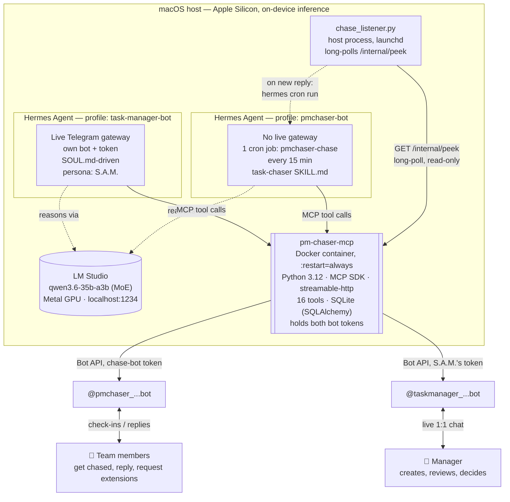
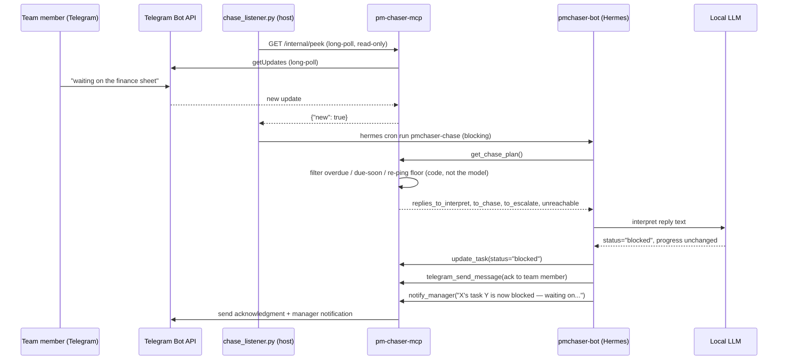
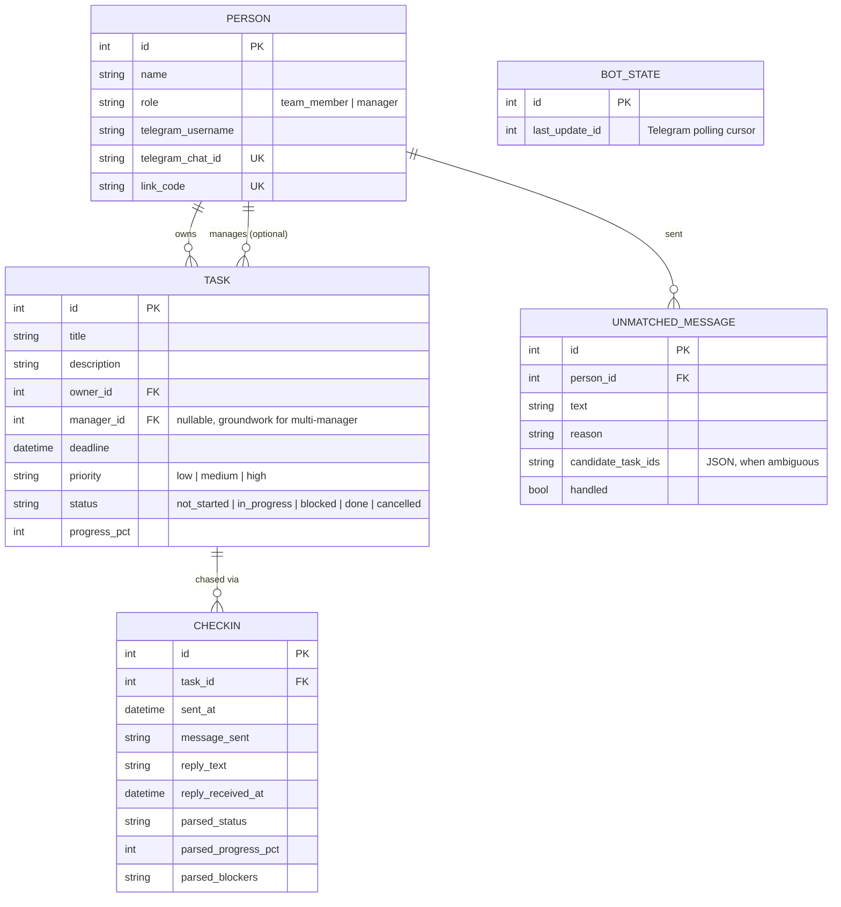

# Architecture

Deep technical reference for how pm-chaser is actually built and wired together, as of **2026-09-02**. For the story of *how* it got here — the Kubernetes experiment, the reliability crisis, the bugs found in real use — see [`PROJECT_MANAGEMENT.md`](../PROJECT_MANAGEMENT.md).

## System overview

Two Hermes Agent **profiles** run side by side, fully isolated from each other (separate config, separate skills, separate memory), sharing only the same local model and the same MCP tool server:

| | `task-manager-bot` | `pmchaser-bot` |
|---|---|---|
| Faces | The manager, live 1:1 chat | Nobody directly — cron only |
| Telegram bot | `@taskmanager_...bot`, restricted via `TELEGRAM_ALLOWED_USERS` | `@pmchaser_...bot` (sent to via the MCP server, not its own gateway) |
| Driven by | `SOUL.md` (persistent instructions) | `task-chaser` `SKILL.md`, loaded per cron run |
| Persona | Fixed: **S.A.M.** — always addresses the manager as "boss" | None — no conversation surface |
| Triggers | Any message from the manager | Every 15 minutes, or instantly on a fresh reply (see below) |

This is a deliberate design choice, not an accident: **team members never get a conversational agent.** They can only reply to check-in messages; there's no live gateway on the employee-facing bot at all. Every model-driven decision about *their* tasks is made by `pmchaser-bot` reading their reply text, not by giving them a chat interface of their own.

## Event-driven reply handling

The 15-minute cron sweep is the safety net, not the primary path. `listener/chase_listener.py` — a small, dependency-free Python script running on the host under `launchd`, independent of both Docker and Hermes — long-polls a plain HTTP route (`GET /internal/peek`, registered directly on the MCP server's Starlette app, *not* an MCP tool) that itself long-polls Telegram's `getUpdates`. The moment a real reply lands, the listener shells out to `hermes -p pmchaser-bot cron run <job-id>`, running the chase job inline, synchronously, right then — not on the next scheduled tick.

The `/internal/peek` route is strictly **read-only**: it never advances the stored Telegram update cursor, so it can never cause a reply to be silently consumed and skipped by the job that actually processes it. Worst case if the listener is ever down, the 15-minute cron still catches everything — nothing depends on the listener for correctness, only for latency.

## The chase-planning tools: pushing judgment out of the model where it doesn't belong

A recurring lesson from real use (see `PROJECT_MANAGEMENT.md`'s "reliability crisis" entry): a ~35B local MoE model chaining five or more sequential tool calls with server-side filtering logic in between is where it starts making mistakes — routing through the wrong indirection, dropping arguments, or narrating a result it never actually produced. The fix wasn't a bigger model; it was **moving the deterministic parts out of the prompt loop entirely.**

`get_chase_plan()` and `get_digest_data()` each do a whole planning pass — querying tasks, computing overdue/at-risk windows, applying the per-priority re-ping floor, grouping repeat-offenders for escalation — in one server-side call, in plain Python. What comes back to the model is already filtered and structured: lists of *who to chase*, *what to escalate*, *which replies need interpreting*. The model's job shrinks to exactly the part that requires language understanding — composing what to say, and deciding what a free-text reply actually means — and nothing else. Code decides *what* and *who*; the model decides *what to say* and *what a reply means*. See [`docs/MCP_TOOLS.md`](./MCP_TOOLS.md) for the full tool catalog this produced.

## Data model

`Task.manager_id` is a second, independent foreign key to `Person` — deliberate groundwork for a future multi-manager setup (an employee could report to different managers on different tasks) without touching today's single-manager call sites, which auto-resolve it to the sole registered manager.

## Deployment history: Kubernetes → plain Docker

`pm-chaser-mcp` originally ran as a Kubernetes `Deployment` + `LoadBalancer` `Service` (manifests kept in [`k8s/`](../k8s/) for reference — not the live deployment). On a single Mac mini with no multi-node scaling need, Kubernetes's actual value — self-healing, rolling deploys, load distribution — never applied; the one thing being used, restart-on-crash, plain Docker's `--restart=always` gives for free, without the LoadBalancer IP drift and `kubectl port-forward` tunnel deaths that had been causing real dropped messages. Migrated 2026-08-14; the full tradeoff discussion is in the devlog.

## Design principle, restated

> **Rules that must always hold live in code, where they're guaranteed. Everything that requires judgment or language stays with the model.**

Concrete examples of this boundary in the current system:
- An employee can never grant themselves a deadline extension — the *skill* routes any such request to `update_task(status="blocked")`, and only the manager's explicit approval (a real `update_task` call with a new deadline) can lift it. The model can't talk its way around this because there's no tool that lets an owner set their own deadline.
- A "message sent" confirmation is only ever true if a real `checkin_id`/`telegram_message_id` came back from `telegram_send_message`'s actual return value — never the model's own narration. This was a real, repeated failure mode (see the devlog's "confident-but-false-confirmation" incidents) closed off by making the *job itself* fail hard when no send tool call ever succeeded, rather than trusting the model's closing sentence.
- The 15-minute floor, the per-priority re-ping cadence, and the escalation grouping are all plain arithmetic and SQL filters in `server/tools.py` — never something the model is asked to compute or remember turn to turn.
