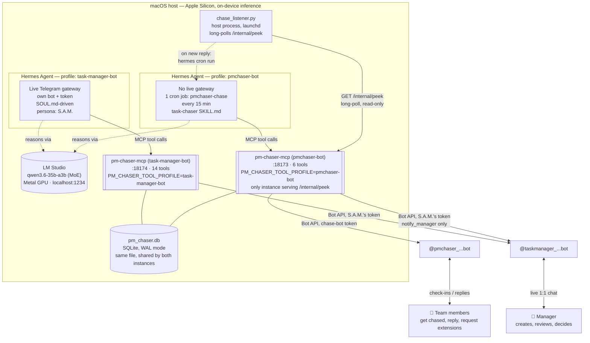
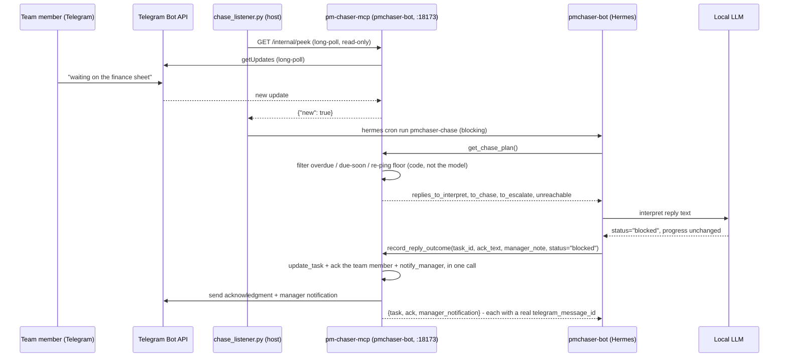
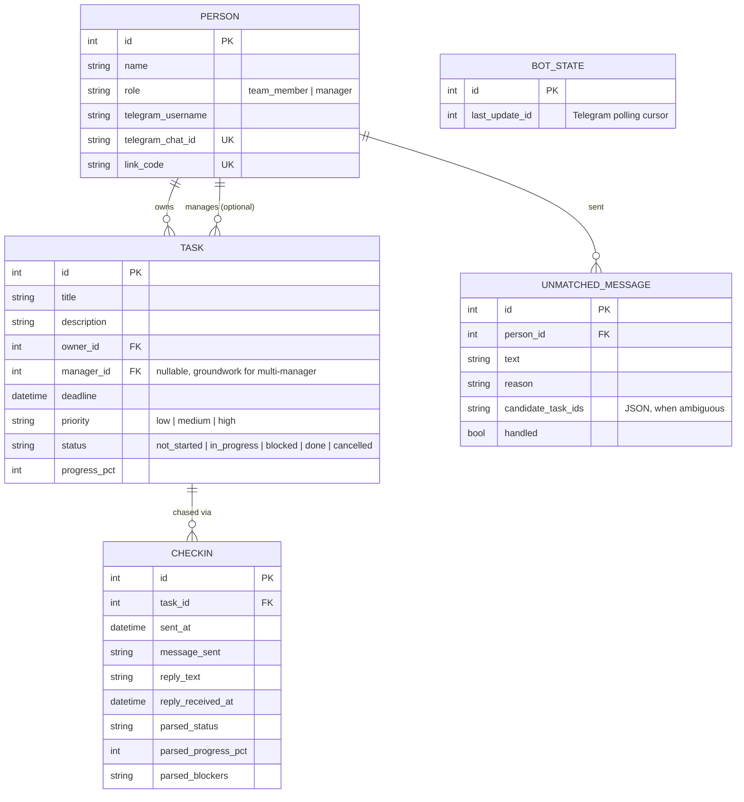

# Architecture

Deep technical reference for how pm-chaser is actually built and wired together, as of **2026-09-03**, following a production-hardening refactor (Phases 0-4: layered `pmchaser/` package, correctness/performance fixes, per-profile tool exposure, and migrations/operations — see [`PROJECT_MANAGEMENT.md`](../PROJECT_MANAGEMENT.md) for the pre-refactor build history and the reliability crisis referenced throughout this doc, and this repo's `git log` on `refactor/production-grade` for the refactor's own reasoning commit-by-commit). The web dashboard mentioned as a possible future addition elsewhere is **not** built yet — everything below reflects the system as it runs today: Telegram-only, no dashboard.

## System overview

As of Phase 3, `pm-chaser-mcp` runs as **two separate server processes** from the same image and the same SQLite database — one per Hermes profile, each advertising only the MCP tools that profile's own instructions actually call (see "Per-profile tool exposure" below). This replaced a single shared instance that advertised its full tool catalog to both profiles regardless of use.

Both instances run from `docker-compose.yml` at the repo root (Phase 4 — replaces what used to be two hand-typed `docker run --restart=always` commands), sharing one named Docker volume so both see the same database file. Ports are published to `127.0.0.1` only, since every real consumer (Hermes's MCP client, `chase_listener.py`) runs on the same host and reaches them via `localhost` — see "Deployment history" below.

Two Hermes Agent **profiles** run side by side, fully isolated from each other (separate config, separate skills, separate memory, separate MCP server instance), sharing only the same local model and the same underlying database:

| | `task-manager-bot` | `pmchaser-bot` |
|---|---|---|
| Faces | The manager, live 1:1 chat | Nobody directly — cron only |
| Telegram bot | `@taskmanager_...bot`, restricted via `TELEGRAM_ALLOWED_USERS` | `@pmchaser_...bot` (sent to via the MCP server, not its own gateway) |
| Driven by | `SOUL.md` (persistent instructions) | `task-chaser` `SKILL.md`, loaded per cron run |
| Persona | Fixed: **S.A.M.** — always addresses the manager as "boss" | None — no conversation surface |
| Triggers | Any message from the manager | Every 15 minutes, or instantly on a fresh reply (see below) |
| MCP server instance | `:18174`, 14 tools | `:18173`, 6 tools — also the only instance serving `/internal/peek` |

This is a deliberate design choice, not an accident: **team members never get a conversational agent.** They can only reply to check-in messages; there's no live gateway on the employee-facing bot at all. Every model-driven decision about *their* tasks is made by `pmchaser-bot` reading their reply text, not by giving them a chat interface of their own.

## Per-profile tool exposure

Before Phase 3, one server instance advertised its full tool catalog (then 16 tools) to both profiles regardless of which ones a profile's own instructions ever called — measured at the time as `pmchaser-bot` paying for all 16 tools' schemas in its prompt every single cron run despite `task-chaser/SKILL.md` only ever calling 5 of them by name, a ~3x token overpay on every run.

`server/pmchaser/mcp/profiles.py` now derives each profile's real tool list empirically (grepped from what `SOUL.md`/`SKILL.md` actually reference), and `main.py` reads `PM_CHASER_TOOL_PROFILE` to decide which subset a given instance registers. `tests/test_mcp_contract.py` boots each profile's real server and asserts it advertises exactly that subset — not a source-level check of `profiles.py` alone, which couldn't prove `main.py` actually wires the env var through. An unrecognized or unset profile value falls back to registering the full set — fails open to "too many tools available," never closed to "no tools at all."

## Event-driven reply handling

The 15-minute cron sweep is the safety net, not the primary path. `listener/chase_listener.py` — a small, dependency-free Python script running on the host under `launchd`, independent of both Docker and Hermes — long-polls a plain HTTP route (`GET /internal/peek`, registered directly on the MCP server's Starlette app, *not* an MCP tool) that itself long-polls Telegram's `getUpdates`. The moment a real reply lands, the listener shells out to `hermes -p pmchaser-bot cron run <job-id>`, running the chase job inline, synchronously, right then — not on the next scheduled tick.

The `/internal/peek` route is strictly **read-only**: it never advances the stored Telegram update cursor, so it can never cause a reply to be silently consumed and skipped by the job that actually processes it. Worst case if the listener is ever down, the 15-minute cron still catches everything — nothing depends on the listener for correctness, only for latency.

**Why `record_reply_outcome` replaced three separate calls (Phase 3):** a real live incident — the manager asked for "chase henry," `chase_now` was called and returned correct data, but the model then narrated a successful send without ever calling `telegram_send_message` — showed this exact failure class isn't limited to a single "did it call the send tool at all" question; the same local model can complete the first call in a short chain and then narrate the rest instead of emitting them. `task-chaser/SKILL.md` step 3 (update the task, acknowledge the reply, notify the manager) was the same shape: one call whose result mattered, then two more the model had to remember to make on its own. Collapsing those three into one server-side call doesn't make skipping the whole thing impossible, but it removes the specific "I already did something, that feels like progress" failure point mid-sequence. See `chase_now`/`get_chase_plan`'s own `action_required` field for the parallel fix on the *chase* side of this same failure class — a plain-language instruction embedded directly in the tool's returned data, restating exactly what still needs to happen before anything can be reported as sent.

## The chase-planning tools: pushing judgment out of the model where it doesn't belong

A recurring lesson from real use (see `PROJECT_MANAGEMENT.md`'s "reliability crisis" entry): a ~35B local MoE model chaining five or more sequential tool calls with server-side filtering logic in between is where it starts making mistakes — routing through the wrong indirection, dropping arguments, or narrating a result it never actually produced. The fix wasn't a bigger model; it was **moving the deterministic parts out of the prompt loop entirely.**

`get_chase_plan()` and `get_digest_data()` each do a whole planning pass — querying tasks, computing overdue/at-risk windows, applying the per-priority re-ping floor, grouping repeat-offenders for escalation — in one server-side call, in plain Python. What comes back to the model is already filtered and structured: lists of *who to chase*, *what to escalate*, *which replies need interpreting*. The model's job shrinks to exactly the part that requires language understanding — composing what to say, and deciding what a free-text reply actually means — and nothing else. Code decides *what* and *who*; the model decides *what to say* and *what a reply means*. See [`docs/MCP_TOOLS.md`](./MCP_TOOLS.md) for the full tool catalog this produced.

## Data model

`Task.manager_id` is a second, independent foreign key to `Person` — deliberate groundwork for a future multi-manager setup (an employee could report to different managers on different tasks) without touching today's single-manager call sites, which auto-resolve it to the sole registered manager.

## Deployment history: Kubernetes → plain Docker → Docker Compose

`pm-chaser-mcp` originally ran as a Kubernetes `Deployment` + `LoadBalancer` `Service` (manifests kept in [`k8s/`](../k8s/) for reference — not the live deployment). On a single Mac mini with no multi-node scaling need, Kubernetes's actual value — self-healing, rolling deploys, load distribution — never applied; the one thing being used, restart-on-crash, plain Docker's `--restart=always` gives for free, without the LoadBalancer IP drift and `kubectl port-forward` tunnel deaths that had been causing real dropped messages. Migrated 2026-08-14; the full tradeoff discussion is in the devlog.

Phase 4 replaced the (by then two, one per profile) hand-typed `docker run --restart=always` commands with a single checked-in `docker-compose.yml` at the repo root — same image, same ports, same named volume, nothing about runtime behavior changed, just made reproducible instead of living only in shell history. It also added, all opt-in or backward-compatible with the existing deployment:

- **`/healthz`** — a plain HTTP route (not an MCP tool) checking real database connectivity, wired to a Docker `HEALTHCHECK` on both instances.
- **A non-root container user** — the image previously ran entirely as root; a small `entrypoint.py` now chowns the mounted data volume and drops to a dedicated `app` user before starting the server, since the existing named volume's files were already root-owned from running that way historically.
- **Loopback-only port publishing** — both instances bind `127.0.0.1` on the host side rather than `0.0.0.0`, closing LAN/internet reachability with no change needed from either real consumer (Hermes's MCP client, `chase_listener.py`), both of which already talk to `localhost`.
- **An optional shared-secret bearer token** (`PM_CHASER_MCP_TOKEN`, unset by default) gating the MCP endpoint and `/internal/peek` — never `/healthz`, which Docker's own healthcheck calls with no `Authorization` header. Off until explicitly configured, so adopting it is a deliberate step, not a silent behavior change.
- **Alembic migrations** (`server/pmchaser/db/migrations/`) — the database previously had no tracked migration history at all, just `Base.metadata.create_all()` creating whatever tables didn't yet exist. A real schema change (a new column, say) now goes through a reviewed migration file instead of an unrepeatable manual step against the live database. See `docs/MIGRATIONS.md` for the adoption path onto an already-existing, hand-managed database.
- **`backup.sh`** — a real, WAL-safe backup of the live database via SQLite's Online Backup API (not a raw file copy, which can capture a WAL-mode database mid-write), run against a throwaway container so it never touches the running service.

## Design principle, restated

> **Rules that must always hold live in code, where they're guaranteed. Everything that requires judgment or language stays with the model.**

Concrete examples of this boundary in the current system:
- An employee can never grant themselves a deadline extension — the *skill* routes any such request to `update_task(status="blocked")`, and only the manager's explicit approval (a real `update_task` call with a new deadline) can lift it. The model can't talk its way around this because there's no tool that lets an owner set their own deadline.
- A "message sent" confirmation is only ever true if a real `checkin_id`/`telegram_message_id` came back from `telegram_send_message`'s actual return value — never the model's own narration. This was a real, repeated failure mode (see the devlog's "confident-but-false-confirmation" incidents) closed off by making the *job itself* fail hard when no send tool call ever succeeded, rather than trusting the model's closing sentence.
- The 15-minute floor, the per-priority re-ping cadence, and the escalation grouping are all plain arithmetic and SQL filters in `server/pmchaser/services/chase.py` and `server/pmchaser/domain/chase_policy.py` — never something the model is asked to compute or remember turn to turn.
